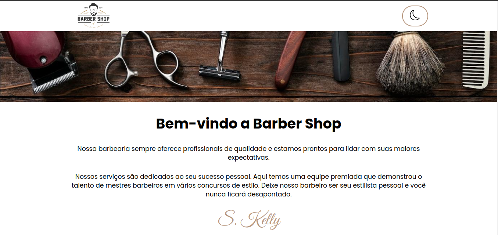

# BARBER SHOP

A proposta desse projeto é criar uma landing page em React, para colocar em prática os conceitos do conhecimento adquirido até aqui.

### Acesse o Link: https://page-barbearia-tigocode.vercel.app/

  

## Sobre:

Ao desenvolver a aplicação foi possível aplicar os seguintes conhecimentos obtidos na trilha de React.js:

 - Criar uma funcionalidade que permita alterar o tema de cores da página através da ação do usuário;
 - Utilizar o State Hook;
 - Aplicar lógica no código de interface da aplicação;
 - Utilizar o operador IF ternário para alterar dinamicamente classes CSS, ícones e textos da aplicação;

## Demonstração

https://github.com/user-attachments/assets/8d4f4660-9895-4f4b-856c-9f8384f11a6c
